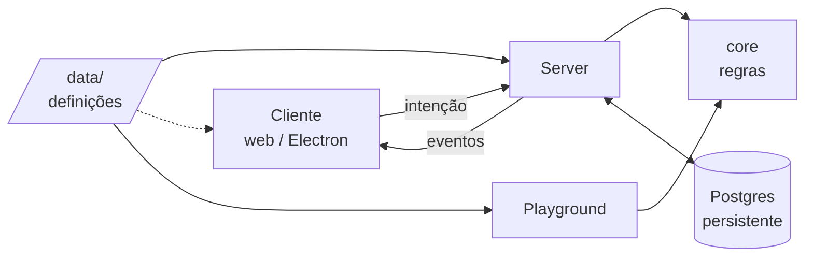
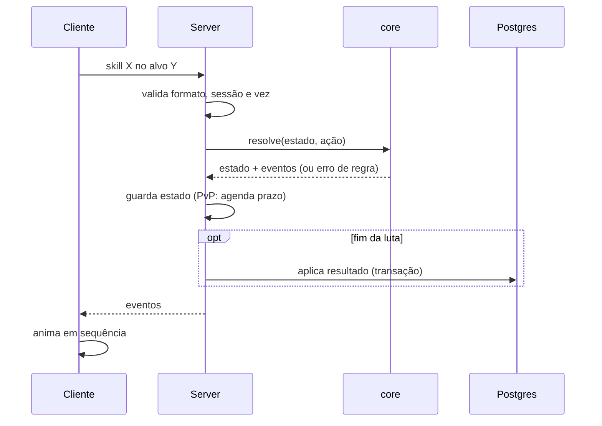

# Arquitetura

## Em uma frase
Servidor autoritativo em TypeScript. Regras puras num `core` compartilhado. Cliente web, empacotado para a Steam, só mostra.

## Princípios
- Servidor decide. Cliente mostra. Cliente manda intenção, nunca resultado.
- Regra é função pura: estado + ação → estado + eventos.
- Determinístico: RNG com semente. Mesma semente + mesmas ações = mesma luta.
- Constante mora em `data/`, nunca no código.
- Escopo pequeno, fronteira certa. Nenhuma peça "por precaução".

## Mapa

## Partes
| Pasta             | Faz                                                    | Não faz                         |
| ----------------- | ------------------------------------------------------ | ------------------------------- |
| `packages/core`   | regras: combate, automação, cálculos                   | rede, banco, tempo, ler arquivo |
| `apps/server`     | conexão, sessão, vez, prazo, auth, banco, carrega data | calcular regra                  |
| `apps/client`     | mostra, anima, coleta intenção                         | decidir resultado               |
| `apps/playground` | roda o core no navegador para testar mecânica          | ir para produção                |
| `data/`           | definições: skills, mobs, zonas, constantes            | guardar estado que muda         |

## Estado
- Estático: `data/`. Carrega no boot. Não muda.
- Persistente: Postgres. Conta, personagem, equipamento, inventário, progressão, mercado. Fonte da verdade.
- Execução: memória do server. Online, zonas, sessões de combate, caçadas, timers. Pode se perder se cair.
- Dono: um processo, um event loop. Só handlers e timers mexem.
- Mudança em memória: síncrona, sem `await` no meio. → evita estado pela metade
- Economia: banco primeiro (transação), memória depois. Uma operação por jogador por vez. → evita item duplicado
- Tempo: timer pergunta "o que venceu?" (prazo de turno, respawn, próximo encontro).

## Posição
- Mundo: server conhece zona e ponto de interesse. Caminho é do cliente.
- Combate: server conhece fila e passo (inteiros). Distância é conta.

## Um turno de combate

## Decisões

### TypeScript em tudo · 2026-10-09
- **Por quê:** core compartilhado com cliente e playground.
- **Reabrir:** após fatias 1–4, com lista escrita de travas da tecnologia.

### Cliente web, Steam via Electron · 2026-10-09
- **Por quê:** jogo cheio de interface; domínio web; Steam é o canal.
- **Não:** Godot, interface mais fraca e sem core compartilhado. Engine 2D, equipamento visível caro.
- **Reabrir:** se o teste de personagem modular em Three.js falhar.

### Servidor autoritativo · 2026-10-09
- **Por quê:** economia relevante exige; evita exploit.
- **Não:** cliente decidindo, abre duplicação e trapaça.
- **Reabrir:** nunca.

### Combate como função pura determinística · 2026-10-09
- **Por quê:** mesmo motor no ativo, auto, PvP, playground e testes.
- **Não:** regra dentro da sessão do server, playground e testes dependeriam do server.
- **Reabrir:** nunca.

### Posição no mundo não é estado de jogo · 2026-10-09
- **Por quê:** não muda resultado de regra.
- **Não:** coordenadas no server, mais tráfego e complexidade sem mudar resultado.
- **Reabrir:** se uma regra passar a depender de posição no mapa.

### Sem Redis, Colyseus ou framework pesado · 2026-10-09
- **Por quê:** nenhum problema real pede isso.
- **Reabrir:** gargalo medido.

## Não decidido de propósito
- Formato das mensagens (JSON por enquanto)
- Framework de interface do cliente
- Reconexão no meio de uma luta
- Ganho offline: fórmula ou simulação
- Escala: dividir zonas em processos
- Hospedagem